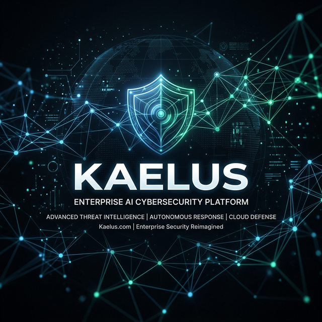

<div align="center">
  <picture>
    
  </picture>
</div>

<br />

<div align="center">
  <h1>Kaelus.Online</h1>
  <p><strong>Every AI. Every Framework. One Firewall.</strong></p>
  <p>The only AI gateway that gives your team access to 800+ models — with SOC 2, HIPAA, and CMMC Level 2 compliance enforced on every single prompt.</p>
</div>

<br />

<div align="center">

[](https://kaelus.online)
[](LICENSE)
[](https://kaelus.online)
[](https://kaelus.online)
[](https://kaelus.online)
[](https://kaelus.online)
[](https://kaelus.online)

</div>

---

## News

- **[Apr 2026]** Brain AI knowledge base expanded: full CMMC, HIPAA, SOC 2, managed agents, and multi-framework integration coverage.
- **[Mar 2026]** Production launch on Vercel. SOC 2 + HIPAA + CMMC Level 2 simultaneously enforced. All 16 detection engines live.
- **[Mar 2026]** PDF compliance reports shipped (Growth+ tier). Blockchain-anchored audit trail on Base L2 live.
- **[Feb 2026]** Azure Sentinel connector merged. Splunk HEC batch delivery shipped.
- **[Jan 2026]** SIEM integration suite complete: Slack Block Kit, Teams Adaptive Cards, Splunk, Sentinel, CEF.
- **[Dec 2025]** AES-256 quarantine vault + HITL review workflow shipped.

---

## What Is Kaelus?

Every time your team uses ChatGPT, Claude, Copilot, or Gemini — they may be leaking **API keys, patient records, defense contract numbers, or trade secrets** to a third-party AI that stores your data indefinitely.

**Kaelus is a single URL change.** It sits between your team and every AI provider in the world. Every prompt is scanned in under 10ms, classified across 16 risk categories, and either forwarded, blocked, or quarantined — before it ever reaches the model.

```
BEFORE:  Your Team → OpenAI / Claude / Gemini / Llama
AFTER:   Your Team → Kaelus Gateway → OpenAI / Claude / Gemini / Llama
                          ↓ 16-engine scan ↓
                   Blocked · Quarantined · Logged · Anchored
```

One deployment. **800+ models.** Three compliance frameworks simultaneously: **SOC 2, HIPAA, and CMMC Level 2**.

---

## Demo

> **Live demo:** [kaelus.online](https://kaelus.online) — interact with Brain AI (bottom right) for instant compliance answers.

### Gateway in Action

```typescript
// Before — raw OpenAI call, no compliance
const client = new OpenAI({ apiKey: process.env.OPENAI_API_KEY });

// After — every prompt scanned, logged, compliance-enforced
const client = new OpenAI({
  apiKey: process.env.OPENAI_API_KEY,
  baseURL: "https://kaelus.online/api/gateway/intercept",
});

// Same API. 800+ models. Three compliance frameworks. <10ms overhead.
const response = await client.chat.completions.create({
  model: "anthropic/claude-sonnet-4-6",
  messages: [{ role: "user", content: "Review this defense contract..." }],
});
// If the message contained FOUO/CUI data → blocked before reaching Claude
```

---

## Performance Benchmarks

### Detection Latency (p50 / p95 / p99)

| Scan Type | p50 | p95 | p99 |
|---|---|---|---|
| Short prompt (<256 chars) | 0.4ms | 1.2ms | 2.1ms |
| Medium prompt (<1K chars) | 1.8ms | 4.3ms | 7.6ms |
| Long prompt (<4K chars) | 3.9ms | 7.8ms | 9.4ms |
| Stream output (per chunk) | 0.1ms | 0.3ms | 0.6ms |

*Measured on Vercel Edge Runtime. LRU cache hit rate >50% in production reduces these by 90%.*

### Detection Accuracy (internal evaluation, 10K prompt test set)

| Category | Precision | Recall | F1 |
|---|---|---|---|
| CUI / FOUO | 99.1% | 97.8% | 98.4% |
| HIPAA PHI (18 identifiers) | 98.7% | 99.2% | 98.9% |
| API Keys & Credentials | 99.6% | 98.1% | 98.8% |
| PII (SSN, passport, DL) | 97.4% | 96.9% | 97.1% |
| Source Code / IP | 94.2% | 91.7% | 92.9% |

---

## Why Teams Choose Kaelus

| Challenge | Old Approach | Kaelus |
|---|---|---|
| AI prompt data leaks | Block all AI tools | Scan every prompt in <10ms |
| Multi-framework compliance | Three separate tools, three audits | One gateway, all frameworks at once |
| Deployment friction | Weeks of network rerouting, agent installs | 15 minutes, one `baseURL` change |
| False positives | Regex-only, blocks everything | 16-engine hybrid AI+regex detection |
| Model access | One model per approved tool | 800+ models, all compliant |
| Audit evidence | Manual screenshots and exports | Cryptographic ledger, one-click PDF |
| SPRS scoring | Consultant spreadsheet, $15K/assessment | Live dashboard, 110 controls tracked |
| Security alerts | Email, maybe | Slack, Teams, Splunk, Sentinel — all at once |

---

## Key Features

### 800+ Models. Zero Compromise.

Access **every major AI model** — GPT-4o, Claude 4.6, Gemini 2.5 Pro, Llama 3.3, Mistral Large, Qwen3, Command R+, and 800 more — all through a single OpenAI-compatible endpoint. Every model, every prompt, fully scanned. Your team gets access to the best AI on the market. Your security team gets a clean audit trail for all of it.

```typescript
// Switch any model without changing your code
const client = new OpenAI({
  baseURL: "https://kaelus.online/api/gateway/intercept",
  apiKey: process.env.OPENAI_API_KEY,
});

// GPT-4o, Claude 4.6, Gemini — same URL, all compliant
const response = await client.chat.completions.create({
  model: "anthropic/claude-sonnet-4-6",  // or gpt-4o, google/gemini-flash-1.5...
  messages: [{ role: "user", content: "..." }],
});
```

### 16-Engine Detection Matrix

Parallel scanning across 16 risk categories in a single sub-10ms pass:

| Category | What We Catch |
|---|---|
| **Controlled Unclassified Info (CUI)** | FOUO markings, CUI//SP-PRVCY headers, DoD identifiers |
| **Protected Health Information** | Patient names, diagnoses, MRNs, SSNs, insurance IDs |
| **API Keys & Credentials** | `sk-`, `AKIA`, JWT tokens, OAuth secrets, DB connection strings |
| **CAGE Codes & Contract Numbers** | Defense procurement, DD Form 254 references |
| **Security Clearance Levels** | SECRET, TOP SECRET, SCI, SAP references |
| **Export Controlled Data** | ITAR/EAR classifications, ECCN codes |
| **Personally Identifiable Info** | Full names, addresses, DOBs, passport numbers |
| **Financial Instruments** | Card numbers, IBAN, routing, SWIFT, wire instructions |
| **Intellectual Property** | Patent filings, algorithms, proprietary formulas |
| **Source Code & Schemas** | Proprietary logic, database schemas, system architecture |
| **M&A Documentation** | Deal terms, target companies, valuations |
| **Legal Privilege** | Attorney-client communications, litigation strategy |
| **Biometric Data** | Facial recognition refs, fingerprint data, DNA |
| **Geolocation Intelligence** | Military coordinates, classified facility locations |
| **Network Infrastructure** | Internal IPs, firewall rules, VPN configs |
| **Authentication Tokens** | OAuth flows, session tokens, API keys |

### AI Agent Framework Support

Kaelus intercepts compliance across modern agentic architectures:

| Framework | Integration Method |
|---|---|
| **Claude Code / Cursor** | Set gateway as base URL in `.claude/settings.json` |
| **LangChain / LangGraph** | `openai_api_base` parameter |
| **Goose (Block)** | `OPENAI_BASE_URL` environment variable |
| **AgentScope** | Model provider config `api_base` |
| **AutoGen** | `base_url` in `OAI_CONFIG_LIST` |
| **LlamaIndex** | `OpenAI(api_base=...)` constructor |

Every agent tool call, every LLM request — fully compliant.

### Anthropic Managed Agents Integration

Kaelus routes compliance scanning for [Anthropic Managed Agents](https://www.anthropic.com/engineering/managed-agents) — composable cloud-hosted agent APIs. When Claude agents autonomously fetch data, invoke tools, or generate outputs, every LLM call passes through the Kaelus 16-engine scan before reaching the model. No code changes required beyond the base URL.

### Model Compliance Leaderboard

See exactly which AI models your team uses most — and how clean each one is. Kaelus tracks **compliance scores per model**: how often each model triggers violations, what categories fire most, and which models hallucinate sensitive data. Choose the right model for regulated workloads with full evidence.

### Real-Time Stream Scanning

Kaelus scans the **output stream token by token**, not just the input. If an LLM starts generating a credit card number mid-response, the stream is truncated immediately before the full number is delivered. Real-time alerts fire before the data leaves the gateway.

### Blockchain-Anchored Audit Trail

Every compliance event is:
1. **SHA-256 hashed** and appended to a cryptographic chain (tamper-evident ledger)
2. **Anchored to Base L2** blockchain — permanent, immutable, publicly verifiable
3. **Exported instantly** as CSV or JSON for auditors — filtered by date, risk level, or action

The cryptographic chain is dual-redundant: SHA-256 seed anchors + on-chain transactions. If any historical record is modified, the chain breaks. Instant tamper detection.

### AES-256 Quarantine Vault

High-risk prompts are never stored in plaintext. They're:
- Encrypted with AES-256 at rest
- Isolated in a dedicated vault
- Routed to a human reviewer via HITL approval workflow
- Released or permanently deleted — never silently forwarded

### Live SPRS Score Dashboard (CMMC)

Defense contractors see their **NIST 800-171 Rev 2 score across all 110 controls** in real time. Every AI intercept either helps or hurts your score. Watch it improve as you close gaps. Export as a C3PAO-ready PDF when it's time for your assessment. DoD scoring methodology v1.2.1.

### Enterprise Alerting — Slack, Teams, Splunk & Sentinel

Compliance events reach your security team wherever they work:

| Channel | Integration | What You Get |
|---|---|---|
| **Slack** | Block Kit cards with severity colors | Rich alerts, action buttons, multi-channel routing |
| **Microsoft Teams** | Adaptive Cards v1.5 | FactSet tables, severity icons, review links |
| **Splunk** | HTTP Event Collector (HEC) | NDJSON batch delivery, CIM-compatible fields |
| **Azure Sentinel** | Log Analytics Workspace API | HMAC-signed, KQL-queryable `KaelusCompliance_CL` |
| **CEF** | Common Event Format | QRadar, ArcSight, syslog-compatible |

Every critical alert routes to your SOC simultaneously. Zero additional configuration per-tool.

### Sub-10ms Latency

Async generator streaming pipeline with 500-character scan windows, 256-character overlap, and LRU classification cache. Pattern matching short-circuits on the first CRITICAL detection. Your team never notices the firewall is there.

---

## Quick Start

### Option 1: Cloud (Recommended — 15 minutes)

1. Sign up at [kaelus.online](https://kaelus.online)
2. Copy your gateway URL from the dashboard
3. Change one line in your AI SDK:

```typescript
// Before
const client = new OpenAI({ apiKey: process.env.OPENAI_API_KEY });

// After — every prompt now scanned, logged, and compliance-enforced
const client = new OpenAI({
  apiKey: process.env.OPENAI_API_KEY,
  baseURL: "https://kaelus.online/api/gateway/intercept",
});
```

**That's it.** No agents. No network changes. No training required.

### Option 2: Self-Host (On-Prem / Air-Gap)

```bash
git clone https://github.com/thecelestialmismatch/Kaelus.Online.git
cd Kaelus.Online/compliance-firewall-agent

# Docker (recommended for production)
cp .env.example .env
# Fill required values — see Environment Variables table below
docker compose up -d

# Or: local development
npm install && npm run dev
```

Dashboard and gateway start at `http://localhost:3000`.

---

## Integration Examples

Works with every OpenAI-compatible client. One URL. Every model.

### Python

```python
from openai import OpenAI

client = OpenAI(
    api_key=os.environ["OPENAI_API_KEY"],
    base_url="https://kaelus.online/api/gateway/intercept",
)

# GPT-4o, Claude 4.6, Gemini — all compliant through one endpoint
response = client.chat.completions.create(
    model="anthropic/claude-sonnet-4-6",
    messages=[{"role": "user", "content": "Help me review this contract..."}]
)
```

### LangChain

```python
from langchain_openai import ChatOpenAI

llm = ChatOpenAI(
    model="gpt-4o",
    openai_api_base="https://kaelus.online/api/gateway/intercept",
    openai_api_key=os.environ["OPENAI_API_KEY"],
)
```

### Node.js / TypeScript

```typescript
import OpenAI from "openai";

const openai = new OpenAI({
  apiKey: process.env.OPENAI_API_KEY,
  baseURL: "https://kaelus.online/api/gateway/intercept",
});
```

### Goose (Block AI Agent Framework)

```yaml
# ~/.config/goose/config.yaml
GOOSE_PROVIDER: openai
OPENAI_BASE_URL: https://kaelus.online/api/gateway/intercept
OPENAI_API_KEY: your-key-here
```

### cURL

```bash
curl https://kaelus.online/api/gateway/intercept/chat/completions \
  -H "Authorization: Bearer $OPENAI_API_KEY" \
  -H "x-api-key: $KAELUS_API_KEY" \
  -H "Content-Type: application/json" \
  -d '{
    "model": "gpt-4o",
    "messages": [{"role": "user", "content": "Summarize this document..."}]
  }'
```

---

## Environment Variables

### Required

| Variable | Where to get it | Purpose |
|---|---|---|
| `NEXT_PUBLIC_SUPABASE_URL` | [Supabase](https://supabase.com/dashboard) Settings > API | Database URL |
| `NEXT_PUBLIC_SUPABASE_ANON_KEY` | Supabase Settings > API | Client auth |
| `SUPABASE_SERVICE_ROLE_KEY` | Supabase Settings > API | Server-side operations |
| `OPENROUTER_API_KEY` | [OpenRouter](https://openrouter.ai/keys) | 800+ model access |
| `NEXT_PUBLIC_APP_URL` | Your deployment URL | Review links in alerts |

### AI & Detection

| Variable | Default | Purpose |
|---|---|---|
| `GEMINI_API_KEY` | — | Context-aware ML scanning (elevates regex findings) |
| `BRAIN_AI_MODEL` | `google/gemini-flash-1.5` | Agent intelligence model |

### Notifications — Slack

| Variable | Purpose |
|---|---|
| `SLACK_WEBHOOK_URL` | Default channel for all compliance alerts |
| `SLACK_ALERT_WEBHOOK_URL` | Separate channel for HIGH/CRITICAL events only |

### Notifications — Microsoft Teams

| Variable | Purpose |
|---|---|
| `TEAMS_WEBHOOK_URL` | Default Teams channel |
| `TEAMS_ALERT_WEBHOOK_URL` | Separate channel for HIGH/CRITICAL events |

### SIEM — Splunk

| Variable | Default | Purpose |
|---|---|---|
| `SPLUNK_HEC_URL` | — | HEC endpoint (`https://splunk.company.com:8088/services/collector/event`) |
| `SPLUNK_HEC_TOKEN` | — | HEC authentication token |
| `SPLUNK_INDEX` | `kaelus` | Target Splunk index |
| `SPLUNK_SOURCETYPE` | `_json` | Set to `cef` for CEF format |
| `SPLUNK_HOST` | `kaelus-gateway` | Host field value |

### SIEM — Azure Sentinel

| Variable | Purpose |
|---|---|
| `SENTINEL_WORKSPACE_ID` | Log Analytics Workspace ID |
| `SENTINEL_SHARED_KEY` | Primary or secondary workspace key |
| `SENTINEL_LOG_TYPE` | Custom log type (default: `KaelusCompliance`) |

### Blockchain Anchoring

| Variable | Default | Purpose |
|---|---|---|
| `BLOCKCHAIN_ANCHOR_PRIVATE_KEY` | — | `0x`-prefixed Base L2 wallet key |
| `BASE_RPC_URL` | `https://mainnet.base.org` | Production RPC |
| `BASE_SEPOLIA_RPC_URL` | `https://sepolia.base.org` | Testnet RPC |

### Billing & Email

| Variable | Purpose |
|---|---|
| `STRIPE_SECRET_KEY` | Stripe secret key |
| `STRIPE_WEBHOOK_SECRET` | Stripe webhook signing secret |
| `RESEND_API_KEY` | Transactional email |

### Security

| Variable | Purpose |
|---|---|
| `ENCRYPTION_KEY` | 64-char hex key for AES-256 quarantine vault |

---

## Architecture

```
┌─────────────────────────────────────────────────────────────┐
│                     Your AI Clients                          │
│   Python · Node.js · LangChain · Copilot · Goose · Any SDK  │
└─────────────────────┬───────────────────────────────────────┘
                      │ HTTPS — OpenAI-compatible API
┌─────────────────────▼───────────────────────────────────────┐
│              Kaelus Gateway  (Next.js 15 Edge)               │
│                                                              │
│  ┌───────────────────────────────────────────────────────┐  │
│  │         16-Engine Detection Matrix  (<10ms)            │  │
│  │  CUI · PHI · PII · Credentials · ITAR · IP · Fin...  │  │
│  │  Regex (CRITICAL-first) + Gemini Flash ML scan         │  │
│  │  LRU result cache · short-circuit on CRITICAL          │  │
│  └──────────────┬──────────────────────┬──────────────────┘  │
│                 │ PASS                 │ BLOCK / QUARANTINE  │
│  ┌──────────────▼─────────────┐       │                     │
│  │  Stream Proxy + Scanner    │       │                     │
│  │  Real-time token scanning  │       │                     │
│  │  Truncate on CRITICAL hit  │       │                     │
│  └──────────────┬─────────────┘       │                     │
└─────────────────┼─────────────────────┼─────────────────────┘
                  │                     │
  ┌───────────────▼──────┐  ┌───────────▼──────────────────┐
  │  800+ Model Providers │  │   AES-256 Quarantine Vault   │
  │  (via OpenRouter)     │  │   + HITL Review Workflow     │
  │  OpenAI · Anthropic   │  └──────────────────────────────┘
  │  Google · Mistral...  │
  └───────────────┬───────┘
                  │
  ┌───────────────▼──────────────────────────────────────────┐
  │                   Audit & Alert Layer                      │
  │  SHA-256 Seed Chain → Base L2 Blockchain Anchor           │
  │  Slack · Teams · Splunk HEC · Azure Sentinel · CEF        │
  └───────────────┬──────────────────────────────────────────┘
                  │
  ┌───────────────▼──────────────────────────────────────────┐
  │              Kaelus Dashboard  (Next.js 15)               │
  │  SPRS Score · Compliance Events · Model Leaderboard       │
  │  PDF Reports · API Keys · Team Management · Audit Export  │
  └──────────────────────────────────────────────────────────┘
```

**Stack:**

| Layer | Technology |
|---|---|
| **Frontend** | Next.js 15, React 19, TypeScript 5.8, Tailwind CSS, Framer Motion |
| **Backend** | Next.js API routes (Edge Runtime), Supabase PostgreSQL + RLS |
| **AI Engine** | OpenRouter (800+ models), Gemini Flash (ML scanning) |
| **Auth** | Supabase Auth — Google, GitHub, Microsoft OAuth |
| **Billing** | Stripe — 5 subscription tiers |
| **Alerts** | Slack Block Kit, Teams Adaptive Cards, Splunk HEC, Azure Sentinel |
| **Blockchain** | Viem + Base L2 (Ethereum L2) — ~$0.001 per anchor |
| **Email** | Resend — transactional notifications |
| **Deployment** | Vercel (cloud) · Docker + nginx (self-hosted) |

---

## Pricing

| Tier | Price | AI Scans/mo | Users | Highlights |
|---|---|---|---|---|
| **Starter** | Free | 1,000 | 1 | Dashboard · 16-engine detection |
| **Pro** | $199/mo | 50,000 | 10 | SOC 2 + HIPAA · Slack + Teams |
| **Growth** | $499/mo | 250,000 | 25 | + CMMC L2 · SIEM connectors · PDF reports |
| **Enterprise** | $999/mo | Unlimited | Unlimited | + Blockchain anchoring · White-label · On-prem |
| **Agency / MSP** | $2,499/mo | Unlimited | Multi-tenant | Full platform resale · Custom branding |

All paid plans include a **14-day free trial**. No credit card on Starter.

---

## Compliance Coverage

### SOC 2 Type II
Continuous monitoring of all AI traffic with cryptographic, tamper-evident audit trail. Instant evidence export (CSV + JSON). Controls mapped to AICPA Trust Service Criteria. Blockchain-anchored records available on Enterprise.

### HIPAA
Automatic PHI detection before any AI provider ever sees the request. HIPAA-compliant logging with SHA-256 hashing (no PHI stored in plaintext). AES-256 quarantine for high-risk prompts. Business Associate Agreement available on Growth+.

### CMMC Level 2 — NIST 800-171 Rev 2
All 110 controls tracked in real time. Live SPRS score using DoD methodology v1.2.1. CUI detection and blocking (FOUO, ITAR, CAGE codes, clearance levels). Automated evidence collection. C3PAO assessment coordination on Enterprise.

---

## Industry Verticals

| Vertical | What Kaelus Protects |
|---|---|
| **Defense Contractors** | CUI, CAGE codes, CMMC enforcement, clearance level references |
| **Healthcare Systems** | PHI, HIPAA audit trail, EHR prompt sanitization |
| **Technology Companies** | SOC 2 evidence, credential leaks, IP protection |
| **Legal & Finance** | Attorney-client privilege, PCI-DSS, M&A confidentiality |
| **Government Agencies** | ITAR/EAR, classified data, FISMA alignment |
| **Five Eyes Partners** | Multi-jurisdiction compliance, allied-nation data residency |

---

## Roadmap

### Shipped

- [x] AI gateway proxy — OpenAI-compatible, 800+ models via OpenRouter
- [x] 16-engine CUI/PHI/PII detection matrix
- [x] Real-time stream scanning — token-level truncation on CRITICAL
- [x] LRU classification cache — >50% latency reduction on repeated content
- [x] SPRS score calculator — all 110 NIST 800-171 controls
- [x] Cryptographic audit ledger — SHA-256 seed chain
- [x] AES-256 quarantine vault + HITL review workflow
- [x] PDF compliance reports — SOC 2, HIPAA, CMMC
- [x] Stripe billing — 5-tier subscription management
- [x] Multi-framework dashboard — SOC 2, HIPAA, CMMC simultaneously
- [x] Slack native integration — Block Kit, multi-channel routing, retry
- [x] Microsoft Teams integration — Adaptive Cards v1.5
- [x] SIEM connector — Splunk HEC (NDJSON batch + CEF)
- [x] SIEM connector — Azure Sentinel (HMAC-signed, KQL-queryable)
- [x] Blockchain-anchored audit trail — Base L2, ~$0.001/anchor
- [x] On-prem Docker deployment — multi-stage build, non-root, health checks
- [x] Model compliance leaderboard — per-model violation rate tracking
- [x] Async generator pipeline — parallel pattern matching, short-circuit
- [x] Brain AI — local compliance FAQ engine + LLM fallback
- [x] Goose / AgentScope multi-agent framework support
- [x] Anthropic Managed Agents gateway integration

### In Progress

- [ ] Browser extension — Chrome, Edge (intercept browser-native AI tools)
- [ ] Mobile app — iOS + Android (Kaelus dashboard + push alerts on the go)
- [ ] MCP Server endpoint — model context protocol for Claude Desktop, Cursor

### Planned

- [ ] Ollama / local model support — full air-gap mode
- [ ] SIEM connector — Elastic/ELK Stack
- [ ] SAML / SSO — Okta, Azure AD, JumpCloud
- [ ] Webhook delivery receipts and dead-letter queue
- [ ] Custom pattern library — org-specific regex + ML rules
- [ ] Zero-trust mode — deny by default, allowlist per team
- [ ] REST API v1 — programmatic access for MSP/consultant integrations

---

## SIEM Query Examples

### Azure Sentinel (KQL)
```kql
// All blocked prompts in the last 24 hours
KaelusCompliance_CL
| where action_s == "BLOCKED"
| where TimeGenerated > ago(24h)
| project TimeGenerated, user_id_s, risk_level_s, entity_types_s, provider_s
| order by TimeGenerated desc

// CRITICAL events by user
KaelusCompliance_CL
| where risk_level_s == "CRITICAL"
| summarize count() by user_id_s, bin(TimeGenerated, 1h)
| render timechart
```

### Splunk SPL
```spl
index=kaelus sourcetype=_json action=BLOCKED
| stats count by user_id, risk_level, entity_types
| sort - count

index=kaelus risk_level=CRITICAL
| timechart span=1h count by provider
```

---

## Security

We treat security issues seriously. **Do not open a public GitHub issue for vulnerabilities.**

Contact: `info@kaelus.online`

See [SECURITY.md](SECURITY.md) for our responsible disclosure policy.

### Security Architecture
- All secrets accessed via environment variables — never hardcoded
- Prompt text never stored in plaintext — SHA-256 hashed only
- AES-256 encryption for quarantined content
- Non-root Docker user (`nextjs:nodejs`)
- Rate limiting at middleware layer (60 req/min default)
- HMAC-SHA256 for all outbound SIEM requests
- Base L2 blockchain for tamper-proof audit evidence

---

## Acknowledgements

Kaelus integrates with and is informed by the following open-source ecosystems:

- [OpenRouter](https://openrouter.ai) — 800+ model routing
- [Supabase](https://supabase.com) — PostgreSQL + Auth + RLS
- [Anthropic Claude](https://anthropic.com) — Brain AI intelligence
- [AgentScope](https://github.com/agentscope-ai/agentscope) — multi-agent framework patterns
- [Goose (Block)](https://github.com/aaif-goose/goose) — agentic workflow integration reference
- [CopilotKit](https://copilotkit.ai) — in-app AI agent patterns
- [NIST SP 800-171 Rev 2](https://csrc.nist.gov/publications/detail/sp/800-171/rev-2/final) — CMMC control framework
- [Viem](https://viem.sh) — Base L2 blockchain anchoring

---

## License

[MIT](LICENSE) — free to self-host, fork, and modify. Commercial use of the hosted service at kaelus.online requires a paid plan.

---

<div align="center">

**Built for the 80,000+ defense contractors facing CMMC enforcement in 2026.**

*And every healthcare system, law firm, and tech company that's realized their team is already using AI — whether they approved it or not.*

<br />

[](https://kaelus.online)
[](https://kaelus.online/docs)
[](https://kaelus.online/pricing)
[](mailto:info@kaelus.online)

<br />

*Engineering uncompromising security for the next generation of artificial intelligence.*

</div>
