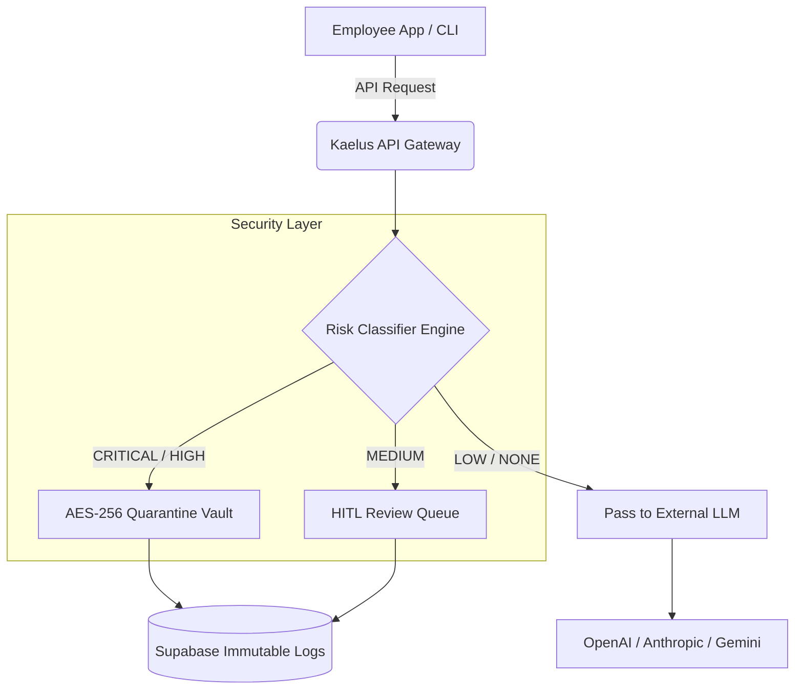

<div align="center">
  <h1>🛡️ Kaelus.ai Wiki</h1>
  <p><strong>The Enterprise-Grade AI Compliance Firewall & Agentic Platform</strong></p>
  <sub>Real-time PII detection • Encrypted quarantine • ReAct agents • 13 AI models • Mission Control • Pixel Office</sub>
</div>

Welcome to the **Kaelus.ai** official Wiki! This is the complete reference for the Kaelus platform — an intelligent security gateway and full agentic AI system that intercepts, classifies, and audits every outbound LLM request in real-time (under `50ms`) before it reaches third-party providers.

---

## ⚡ Core Capabilities

### Compliance Firewall
| Capability | Details |
|-----------|---------|
| **Real-Time Interception** | Sub-50ms scanning of every LLM request via transparent proxy |
| **16 Detection Patterns** | SSNs, credit cards, API keys, emails, phone numbers, M&A data, medical records, code secrets |
| **3-Tier Classification** | ALLOW / BLOCK / QUARANTINE with confidence scoring |
| **Encrypted Quarantine** | AES-256-CBC encryption for flagged content, human-in-the-loop review |
| **Immutable Audit Trail** | SHA-256 hash chains — tamper-proof logging for every event |
| **1-Click Reports** | CFO-ready compliance reports for SOC 2, GDPR, HIPAA, EU AI Act |

### Agentic AI System
| Capability | Details |
|-----------|---------|
| **ReAct Reasoning Loop** | Observe → Think → Act → Iterate — autonomous decision-making |
| **8 Built-in Tools** | Web search, code execution, compliance scan, data query, file analysis, chart generation, knowledge base, web browsing |
| **18 Agent Templates** | SOC Analyst, Legal Reviewer, Financial Auditor, DevSecOps, Privacy Officer, Healthcare Compliance, Risk Analyst, Content Moderator, Regulatory Monitor, and more |
| **13 AI Models** | 8 free + 5 premium via OpenRouter — auto-routed per task |
| **Memory DNA** | Persistent agent identity with lessons, safeguards, and personality traits |

### Pixel Office 🎮
| Capability | Details |
|-----------|---------|
| **Live Agent Visualization** | Canvas 2D pixel-art office with animated agent characters |
| **BFS Pathfinding** | Agents walk to desks via shortest-path on tile grid |
| **Character State Machine** | Idle → Walk → Type/Read/Wait with animated sprite frames |
| **6 Character Palettes** | Diverse pixel-art agents: Scout, Sentinel, Analyst, Diplomat, Guardian, Archivist |
| **Office Furniture** | Desks, chairs, monitors, plants, bookshelves, water coolers |

> Inspired by [pixel-agents](https://github.com/pablodelucca/pixel-agents) — source repo also cloned at `Kaelus.ai/pixel-agents/`.

---

## 🏗️ System Architecture

<details>
<summary><b>View High-Level Architecture Diagram</b> (Click to expand)</summary>


</details>

### Risk Classification Pipeline
1. **Obfuscation Decoder** — Detects and decodes base64/hex masks to prevent regex evasion.
2. **Pattern Matcher** — Runs 16+ regex patterns across 4 categories (PII, Financial, Strategic, IP).
3. **Risk Aggregator** — Scores prompt threat density, computes per-entity and overall confidence.
4. **Action Decider** — Enforces BLOCK / QUARANTINE / ALLOW based on risk level and policy rules.

---

## 🖥️ Mission Control Dashboard

The dashboard (`/dashboard`) is a 17-tab command center:

| Tab | Icon | Function |
|-----|------|----------|
| **Overview** | `LayoutDashboard` | Real-time threat dashboard with live compliance metrics |
| **Real-Time Feed** | `Zap` | Live event stream as requests flow through the gateway |
| **Threat Timeline** | `Activity` | Historical threat activity visualization |
| **Event Log** | `Activity` | Searchable compliance event history |
| **Quarantine** | `AlertTriangle` | Encrypted content review queue (HITL approval) |
| **Live Scanner** | `Scan` | Interactive prompt scanner with instant classification |
| **Agent Workspace** | `Brain` | Full agentic AI environment with ReAct execution trace |
| **Agent Builder** | `Bot` | Create and configure agents from 18 templates |
| **AI Chat** | `MessageSquare` | Streaming AI conversations with model switching (13 models) |
| **Knowledge Base** | `Database` | Document store for agent context and retrieval |
| **Pixel Office** | `Gamepad2` | 🎮 Animated pixel-art office with live agent visualization |
| **Content Pipeline** | `Kanban` | Content lifecycle management board |
| **Tasks Board** | `ListChecks` | Priority-based task management |
| **Agent Team** | `Users` | Fleet management for AI sub-agents |
| **Calendar** | `Calendar` | Scheduled scans, reviews, and automated jobs |
| **Memory DNA** | `BookMarked` | Persistent agent identity — lessons, safeguards, personality |
| **Settings** | `Settings` | API keys, webhook config, policy rules, OpenRouter key |

---

## 🤖 AI Models (13 Total)

| Model | Provider | Tier |
|-------|----------|------|
| GPT-4o | OpenAI | Premium |
| Claude 3.5 Sonnet | Anthropic | Premium |
| Gemini 2.5 Pro | Google | Premium |
| GPT-4o Mini | OpenAI | Premium |
| Claude 3.5 Haiku | Anthropic | Premium |
| Gemini 2.0 Flash | Google | **Free** |
| Llama 3.3 70B | Meta | **Free** |
| DeepSeek V3 | DeepSeek | **Free** |
| Qwen 2.5 72B | Alibaba | **Free** |
| Mistral Small 3.1 | Mistral | **Free** |
| Gemma 3 27B | Google | **Free** |
| Nemotron 70B | NVIDIA | **Free** |
| Phi-4 Reasoning Plus | Microsoft | **Free** |

---

## 🚀 Quick Start

```bash
# 1. Clone the repository
git clone https://github.com/thecelestialmismatch/Kaelus.ai.git

# 2. Enter the directory
cd Kaelus.ai/compliance-firewall-agent

# 3. Install dependencies
npm install

# 4. Configure environment
cp .env.example .env.local
# Add your OPENROUTER_API_KEY to .env.local

# 5. Start development server
npm run dev
# Open http://localhost:3000
```

> **Note:** Kaelus works out of the box in demo mode. For full functionality, configure Supabase and an `OPENROUTER_API_KEY`. See `.env.example` for all options.

---

## 📁 Project Structure

```
Kaelus.ai/
├── compliance-firewall-agent/     # Main application (Next.js 14)
│   ├── app/
│   │   ├── page.tsx               # Landing page
│   │   ├── features/              # Features page
│   │   ├── how-it-works/          # How It Works page
│   │   ├── agents/                # AI Agents page
│   │   ├── pricing/               # Pricing page
│   │   ├── auth/                  # Authentication
│   │   ├── dashboard/             # Mission Control (17 tabs)
│   │   ├── docs/                  # API documentation
│   │   └── api/                   # 11 API endpoints
│   ├── components/
│   │   ├── dashboard/             # 18 dashboard components
│   │   │   └── pixel-office/      # 🎮 Pixel Office (sprites, engine, React)
│   │   └── ui/                    # Shared UI components
│   ├── lib/
│   │   ├── agent/                 # ReAct orchestrator, memory, tools
│   │   ├── classifier/            # 16 detection patterns
│   │   ├── quarantine/            # AES-256 encryption
│   │   ├── audit/                 # SHA-256 hash chains
│   │   └── hitl/                  # Human-in-the-loop approval
│   ├── agents/                    # Agent persona definitions
│   └── middleware.ts              # Request interception
├── pixel-agents/                  # 🎮 Cloned pixel-agents source
│   ├── src/                       # VS Code extension source
│   └── webview-ui/                # Canvas 2D game engine (React 19)
├── agent-lightning/               # Lightning agent module
├── README.md                      # Project overview
├── CONTRIBUTING.md                # Contribution guidelines
└── LICENSE                        # MIT License
```

---

## 🔌 API Reference

| Method | Endpoint | Description |
|--------|----------|-------------|
| `POST` | `/api/gateway/intercept` | Scan LLM requests for sensitive data |
| `POST` | `/api/gateway/stream` | Streaming compliance gateway (SSE) |
| `POST` | `/api/agent/execute` | Execute agentic AI with ReAct loop |
| `POST` | `/api/chat` | Streaming AI conversations |
| `GET` | `/api/compliance/events` | Fetch compliance event log |
| `POST` | `/api/quarantine/review` | Review quarantined content |
| `GET` | `/api/reports/generate` | Generate compliance reports |
| `POST` | `/api/policy/update` | Update firewall policies (HITL gated) |
| `POST` | `/api/scan` | Quick content scan |
| `GET` | `/api/events/stream` | SSE real-time event stream |
| `GET` | `/api/health` | System health check |

---

## 🛠️ Tech Stack

| Layer | Technology |
|-------|-----------|
| **Framework** | Next.js 14 (App Router) |
| **Language** | TypeScript 5 |
| **Styling** | Tailwind CSS + custom design system |
| **AI Gateway** | OpenRouter (multi-provider routing) |
| **Streaming** | Server-Sent Events (SSE) |
| **Encryption** | AES-256 (quarantine) + SHA-256 (audit) |
| **Auth** | Social login (Google, GitHub, Microsoft, SSO) + email |
| **Visualization** | Canvas 2D (Pixel Office) |
| **Database** | Supabase (PostgreSQL + RLS) |
| **Deployment** | Vercel / Docker |

---

## 📚 Wiki Directory

- **[Architecture Deep Dive](ARCHITECTURE.md)** — Full system architecture with threat model
- **[Enhanced Architecture](ENHANCED_ARCHITECTURE.md)** — Extended architecture documentation
- **[Deployment Guide](DEPLOY-GUIDE.md)** — Vercel, Docker, and self-hosted deployment
- **[Contributing](../../CONTRIBUTING.md)** — How to contribute to Kaelus
- **[API Documentation](/docs)** — Interactive API docs at `/docs`

---

## 🔒 Regulatory Alignment

| Standard | Status |
|----------|--------|
| **SOC 2 Type II** | ✅ Immutable audit trails, access controls, encryption |
| **GDPR** | ✅ Data minimization, consent tracking, right to erasure |
| **HIPAA** | ✅ PHI detection, encryption at rest, access logging |
| **EU AI Act** | ✅ Risk classification, transparency, human oversight |

---

<div align="center">
  <sub>Built with Next.js 14, React 18, TypeScript, Tailwind CSS, and Canvas 2D.</sub><br/>
  <sub>Powered by 13 AI models via OpenRouter • 🎮 Pixel Office by <a href="https://github.com/pablodelucca/pixel-agents">pixel-agents</a></sub>
</div>
